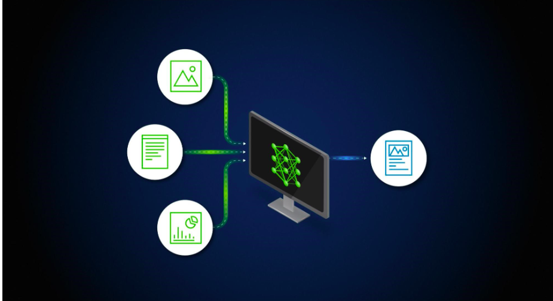

# Retrieval-Augmented Generations

   




This application   empowers you to interact with your PDFs through a user-friendly chat interface. It leverages cutting-edge large language models (LLMs) to revolutionize how you engage with digital documents.

**Key Features:**

* **Effortless Chat Interface:** Ask questions and get answers directly from your PDFs in a conversational manner.
* **Advanced PDF Search:** Find specific information within PDFs quickly and efficiently.
* **Document Summarization:** Generate concise summaries of your PDFs to grasp key points readily.

**Getting Started:**

1. **Clone the Repository:**
   ```bash
   git clone https://github.com/Biniyamseid/RAG.git
   cd RAG
   ```

2. **Install Dependencies:**
   Ensure you have Python 3 and Git installed. Then, run:
   ```bash
   pip install -r requirements.txt
   ```

3. **Launch the Application:**
   Open a terminal in the project directory and execute:
   ```bash
   streamlit run app.py
   ```
   OR
   ```bash
   python3 -m streamlit run app.py
   ```

   This will launch the application in a web browser, typically at http://localhost:8501.

**Building Blocks of RAG:**

This application relies on a powerful combination of libraries to deliver its functionality:

* **langchain (0.0.184):** Integrates LLMs with reasoning capabilities, allowing for deeper understanding and interaction with PDF content.
* **PyPDF2 (3.0.1):** Enables essential PDF manipulations like reading and extracting text, the foundation for processing documents within RAG.
* **python-dotenv (1.0.0):** Securely manages configuration and sensitive information by loading them from a `.env` file.
* **streamlit (1.18.1):** Creates the user-friendly chat interface for seamless interaction with the model.
* **openai (0.27.6):** Integrates OpenAI's GPT models for generating text and performing NLP tasks, essential for understanding and responding to user queries.
* **faiss-cpu (1.7.4):** Facilitates efficient retrieval of relevant documents from the PDF corpus, enhancing the overall search process.
* **altair (4.x):** (Optional) Provides interactive visualizations for data analysis, allowing you to explore the results in a visual way.
* **tiktoken (0.4.0):** Prepares text data for processing by tokenizing and cleaning it.
* **InstructorEmbedding (Custom):** A custom library for managing embeddings, used to represent complex queries and documents for better comprehension by the model.
* **sentence-transformers (2.2.2):** Generates sentence embeddings crucial for semantic search and document retrieval within RAG.

These libraries work together to provide a powerful and interactive experience for exploring and summarizing your PDF documents.

**Feel free to explore the code and customize it further to meet your specific needs!**

